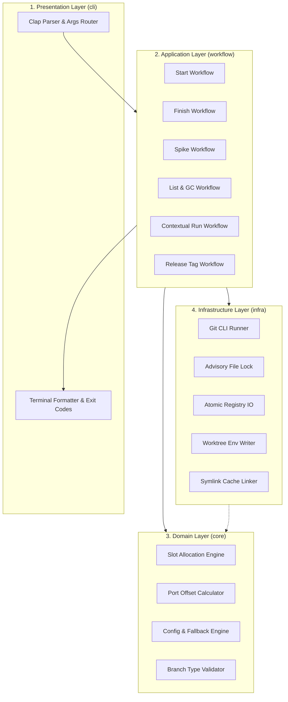
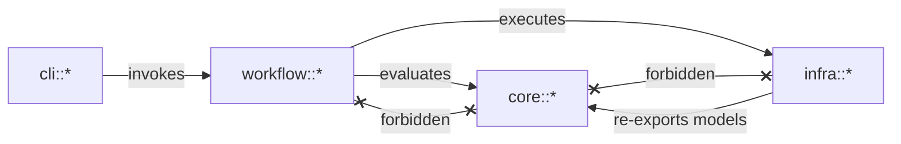

# Architecture Spine — git-claw

## Design Paradigm

`git-claw` implements a **Layered Command-Driven Architecture**. Execution is strictly synchronous, unprivileged, and unidirectional: command invocations trigger deterministic lifecycle workflows that coordinate domain models and execute atomic filesystem and Git operations.



### Boundary & Dependency Invariants
- `core/` contains pure domain logic with **zero side-effects and zero I/O**. It must not import `infra/`, `workflow/`, or `cli/`.
- `workflow/` orchestrates business pipelines by composing `core/` rules and `infra/` side-effects.
- `infra/` encapsulates external OS interactions (Git subprocesses, advisory locking, JSON parsing, environment files).
- `cli/` handles argument parsing and terminal rendering, mapping typed errors into standard UNIX exit codes.

---

## Invariants & Rules



### AD-1 — Invocation Model & Native Git Subcommand [ADOPTED]

- **Binds:** `cli`, `main.rs`
- **Prevents:** Custom wrapper requirements and behavioral divergence from Git ecosystem standards.
- **Rule:** The compiled binary is named `git-claw`. It must support transparent execution either directly (`git-claw <args>`) or as a native Git subcommand (`git claw <args>`). All Git interactions delegate directly to system `git` via `std::process::Command` without linking dynamic C bindings (`libgit2`), preserving user credentials, hooks, and Git configurations.

### AD-2 — Zero-Config Plug-and-Play Defaults [ADOPTED]

- **Binds:** `core/config.rs`
- **Prevents:** Mandatory setup friction or failure when `.git-claw.toml` is absent.
- **Rule:** If `.git-claw.toml` is absent, `git-claw` must construct a valid `Config` using deterministic defaults: `main_branch = "main"`, `worktree_root = "../<repo_name>-worktrees"`, empty port mappings, empty hooks, and `cache.strategy = "shared"`. Configuration structures are strictly immutable during workflow execution.

### AD-3 — Concurrency & Atomic Registry Mutation [ADOPTED]

- **Binds:** `infra/registry.rs`, `infra/lock.rs`
- **Prevents:** Race conditions and corrupted JSON when multiple agents or human shells execute commands simultaneously.
- **Rule:** Every read-modify-write operation on `.git/claw/slots.json` must acquire an exclusive advisory file lock on `.git/claw/slots.lock` with a 5-second timeout. Modifications must be written to a temporary file in `.git/claw/` and committed via atomic rename (`std::fs::rename`) before releasing the lock.

### AD-4 — Self-Healing Slot Registry on Inspection [ADOPTED]

- **Binds:** `core/slot.rs`, `workflow/list.rs`, `workflow/start.rs`
- **Prevents:** Stale slot exhaustion resulting from manual deletion of worktree directories (`rm -rf`).
- **Rule:** Any workflow querying or allocating slots must verify that the recorded `worktree_path` exists on disk. Any entry pointing to a missing directory must be automatically purged from `.git/claw/slots.json` and its `Slot ID` released without raising user errors.

### AD-5 — Deterministic Port Calculation & Environment Injection [ADOPTED]

- **Binds:** `core/port.rs`, `infra/env_file.rs`
- **Prevents:** Local service port collisions and divergent container naming in concurrent workspaces.
- **Rule:** Effective ports are calculated as: `Effective Port = Base Port + Slot ID`. On worktree creation, `git-claw` writes `.env.worktree` containing:
  - `CLAW_SLOT_ID=<id>`
  - `CLAW_WORKTREE_NAME=<name>`
  - `CLAW_WORKTREE_PATH=<path>`
  - `COMPOSE_PROJECT_NAME=<repo>_<name>_<slot_id>`
  - `PORT_<KEY>=<effective_port>` for each port declared in `[ports]`.

### AD-6 — Hook Execution Semantics & Fault Tolerance [ADOPTED]

- **Binds:** `workflow/start.rs`, `workflow/finish.rs`, `infra/hook.rs`
- **Prevents:** Inconsistent lifecycle failures or uninspected state loss.
- **Rule:**
  - `post_start`: Non-fatal. Failure outputs a warning to stderr, exits with code 0, and retains the worktree.
  - `pre_finish`: Fatal gatekeeper. Failure terminates execution immediately with code 1, aborting merge and worktree removal, unless `--force` is supplied.
  - `post_finish`: Non-fatal. Outputs a warning to stderr on non-zero exit status.

### AD-7 — Cache Sharing via POSIX Symlinks [ADOPTED]

- **Binds:** `workflow/start.rs`, `infra/fs.rs`
- **Prevents:** Massive disk consumption and build cache duplication across worktrees while avoiding elevated privileges.
- **Rule:** When `cache.strategy = "shared"`, `git-claw` creates POSIX relative symlinks from the worktree to the primary repository directories declared in `.git-claw.toml` (`cache.directories`). If `--isolated` is supplied, symlink creation is skipped.

### AD-8 — Branch Lifecycle & Trunk Discipline [ADOPTED]

- **Binds:** `workflow/start.rs`, `workflow/finish.rs`, `workflow/spike.rs`
- **Prevents:** Orphaned branches, dirty trunk state, and accidental merging of exploratory spikes.
- **Rule:**
  - `start` creates branches prefixed with their type: `feature/<name>`, `bugfix/<name>`, `hotfix/<name>`, `spike/<name>`.
  - `finish` merges the branch into the configured `main_branch`, deletes the local branch, and runs `git worktree remove`.
  - `spike drop` directly deletes the worktree and branch without merging.

---

## Consistency Conventions

| Concern | Convention |
| --- | --- |
| Binary & Commands | Binary named `git-claw`. Subcommands: `start`, `finish`, `spike drop`, `list`, `run`, `open`, `cd`, `tag`. |
| Branch Naming | Pattern: `<type>/<kebab-case-name>`. Types allowed: `feature`, `bugfix`, `hotfix`, `spike`. |
| Workspace Paths | Default: `../<repo_name>-worktrees/<name>/`. Normalized using canonical absolute paths. |
| Registry Schema | Stored at `.git/claw/slots.json`. Root object: `{"version": 1, "slots": [{"id": 1, "branch": "...", "path": "...", "allocated_at": "..."}]}`. |
| Port Environment Keys | Prefixed with `PORT_` and converted to uppercase snake_case (e.g., `web` -> `PORT_WEB`). |
| Error Handling | Library errors use `thiserror`. Fatal application errors print concise message to stderr and return non-zero exit codes. |
| Terminal Output | Informational status printed to stdout with ANSI colors. Warnings and errors printed to stderr. |

---

## Stack

| Name | Version |
| --- | --- |
| Rust Edition | 2021 |
| clap | 4.5 |
| serde | 1.0 |
| serde_json | 1.0 |
| toml | 0.8 |
| fd-lock | 4.0 |
| colored | 2.2 |
| tempfile | 3.14 |
| assert_cmd | 2.0 |
| predicates | 3.1 |

---

## Structural Seed

```text
git-claw/
├── Cargo.toml
├── src/
│   ├── main.rs                  # CLI entrypoint, error mapping to exit codes
│   ├── cli/                     # Presentation layer: clap argument definitions & rendering
│   │   ├── mod.rs
│   │   ├── args.rs              # Subcommand structs & enums
│   │   └── output.rs            # Table formatting and color helpers
│   ├── workflow/                # Application layer: orchestration pipelines
│   │   ├── mod.rs
│   │   ├── start.rs             # Worktree creation, slot allocation, symlinking, post_start
│   │   ├── finish.rs            # Pre_finish hooks, merge to trunk, cleanup
│   │   ├── spike.rs             # Spike creation and drop
│   │   ├── list.rs              # Active slots listing and auto-GC
│   │   ├── run.rs               # Contextual command execution inside worktree
│   │   └── tag.rs               # SemVer validation and tag creation
│   ├── core/                    # Domain layer: pure logic, zero I/O
│   │   ├── mod.rs
│   │   ├── slot.rs              # Slot allocation logic and recycling
│   │   ├── port.rs              # Deterministic port offset arithmetic
│   │   ├── config.rs            # Config model and defaults (.git-claw.toml)
│   │   └── error.rs             # Domain error enumerations
│   └── infra/                   # Infrastructure layer: side effects & OS operations
│       ├── mod.rs
│       ├── git.rs               # std::process::Command wrappers for Git
│       ├── registry.rs          # Atomic slots.json IO and auto-GC
│       ├── lock.rs              # File locking on .git/claw/slots.lock
│       ├── env_file.rs          # .env.worktree formatting and writing
│       └── fs.rs                # Symlink creation and path utilities
└── tests/                       # Integration tests (black-box CLI testing)
    ├── common/                  # Test helpers (temporary Git repository scaffolding)
    ├── test_start_finish.rs     # End-to-end start, finish, merge tests
    ├── test_concurrency.rs      # Concurrent slot allocation stress test
    ├── test_hooks.rs            # Hook failure and --force behavior tests
    └── test_self_healing.rs     # Orphaned worktree auto-GC tests
```

### Operational & Environment Envelope
- **Deployment & Distribution**: Compiled as a single static or dynamic binary `git-claw`. Distributed via Cargo (`cargo install git-claw`), GitHub Releases (precompiled binaries for Linux x86_64/aarch64, macOS x86_64/arm64), and homebrew/AUR.
- **Runtime Dependencies**: Zero external daemons. Requires only Git >= 2.20 available on the system `$PATH`.
- **Filesystem Permissions**: Operates strictly within user-level permissions. Reads and writes strictly to the local `.git/` directory and specified worktree directories.

---

## Capability → Architecture Map

| Capability / Area | Lives in | Governed by |
| --- | --- | --- |
| FR-1: Configuration Parsing | `core/config.rs`, `infra/fs.rs` | AD-2 |
| FR-2: Slot Registry & Self-Healing | `core/slot.rs`, `infra/registry.rs`, `infra/lock.rs` | AD-3, AD-4 |
| FR-3: Worktree Creation & Ports | `workflow/start.rs`, `core/port.rs`, `infra/env_file.rs` | AD-1, AD-5, AD-7, AD-8 |
| FR-4: Worktree Completion & Merge | `workflow/finish.rs`, `infra/git.rs`, `infra/hook.rs` | AD-1, AD-6, AD-8 |
| FR-5: Spike Abandonment | `workflow/spike.rs`, `infra/git.rs` | AD-8 |
| FR-6: Status Dashboard & Auto-GC | `workflow/list.rs`, `cli/output.rs`, `infra/registry.rs` | AD-4 |
| FR-7: Contextual Execution (`run`) | `workflow/run.rs`, `infra/env_file.rs` | AD-5 |
| FR-8: Editor & Shell Helpers (`open`, `cd`) | `cli/args.rs`, `workflow/mod.rs` | AD-1 |
| FR-9: Release Tagging | `workflow/tag.rs`, `infra/git.rs` | AD-1 |

---

## Deferred

| Item | Reason for Deferral |
| --- | --- |
| Shell wrapper auto-installer (`claw() { ... }`) | Shell functions depend on user-specific shell configurations (`.bashrc`, `.zshrc`, `.config/fish`). Handled via documentation instructions in v0.1.0; auto-installation deferred to v0.2.0. |
| Interactive TUI Dashboard (`ratatui`) | Standard CLI table via `list` satisfies all MVP monitoring and AI agent needs. Interactive dashboard deferred to v0.3.0. |
| Remote multi-host worktrees | v1.0 strictly coordinates local developer and agent concurrency on a single machine. Multi-host orchestration is out of scope. |
